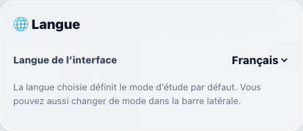

# WordWise Web v2.0 public beta

[Open the portal](https://wordwise.dpdns.org/) in your browser. Public
registration is available, and existing users can keep using their accounts.
The desktop packages linked from the main README remain v1.0.

## Start a study session

1. Register or sign in. New registrations receive **10 AI credits and 100
   learning points**. When the daily registration limit is reached, try again
   after the next Shanghai midnight; existing accounts can still sign in.
2. Open **Settings & vocabulary → Language** to choose the interface language.
   The login card also has a compact selector. A saved choice overrides browser
   detection; without one, French and Chinese browsers select their matching
   interface, and other browsers select English.
3. Use the sidebar to select Chinese–English or French–English study. You study
   English words and type their meanings in Chinese or French. Interface
   language and study mode can be changed separately. French interface defaults
   to French study; Chinese and English interfaces default to Chinese study.
4. Choose a vocabulary list and random, sequential or adaptive practice. In
   French study, the built-in choices are **TOEFL, IELTS and Tous les mots**;
   **Mes mots** is your personal list. Chinese vocabulary choices are separate.
5. Submit an answer for AI feedback, use the hint levels when needed, and review
   mistakes or the confusion map. Use Settings & vocabulary to manage and
   import/export your personal words. Learning points and AI credits are
   separate balances; check the displayed cost before an action.

The screenshot shows only the language control and its help text. It contains
no account details or learning records.

## Beta status and daily limits

> Beta — Features, AI grading and hints may be unstable or inaccurate.

This localized notice appears in French–English mode. The whole hosted release
remains a public beta, including Chinese study. AI feedback is a learning aid
and may be wrong; broader model-quality and stable-release qualification remain
unfinished. Responses may take longer while a provider request is retried.

- **50 successful registrations per Shanghai calendar day**, shared by the
  service. Existing accounts remain usable when registration is full.
- **100 outbound AI calls per Shanghai calendar day**, shared across all
  accounts, including administrator/test accounts, retries, internal AI reviews
  and provider connection tests. One action can cause more than one outbound
  call. Local and cached actions do not consume a provider call.
- Limits reset at **00:00 Asia/Shanghai (UTC+8)**. AI credits are separate from
  this service-wide provider-call limit; unused credits do not bypass it.

The web service stores your account and learning data on its server. See its
[privacy notice](https://wordwise.dpdns.org/privacy.html) and
[terms](https://wordwise.dpdns.org/terms.html). The desktop app's local-storage
description in the README applies to the desktop edition.

## Web changelog — 6 October 2026

- Released the hosted portal as **WordWise v2.0 public beta**, with ordinary
  registration and existing-account access.
- Added French–English study and French, Chinese and English interface choices.
- Preserved existing accounts and learning records through the upgrade.
- Added an upgrade notice shown until each eligible user acknowledges it. It
  describes the update and the **one-time 15 AI-credit gift** for accounts
  existing at the v2.0 upgrade. Acknowledgment is saved to the account.
- The upgrade gift is **not** an ongoing grant or a new-signup bonus. New
  registrations receive the normal **10 AI credits and 100 learning points**.
- Moved the learning-screen interface-language control into Settings, reclaiming
  the space formerly occupied by the floating top row. Kept the compact login
  selector, browser detection and saved choices.
- Shortened the localized French-mode beta notice and retained the shared
  registration and AI-call limits.

Questions or feedback: [feedback@wordwise.dpdns.org](mailto:feedback@wordwise.dpdns.org).
